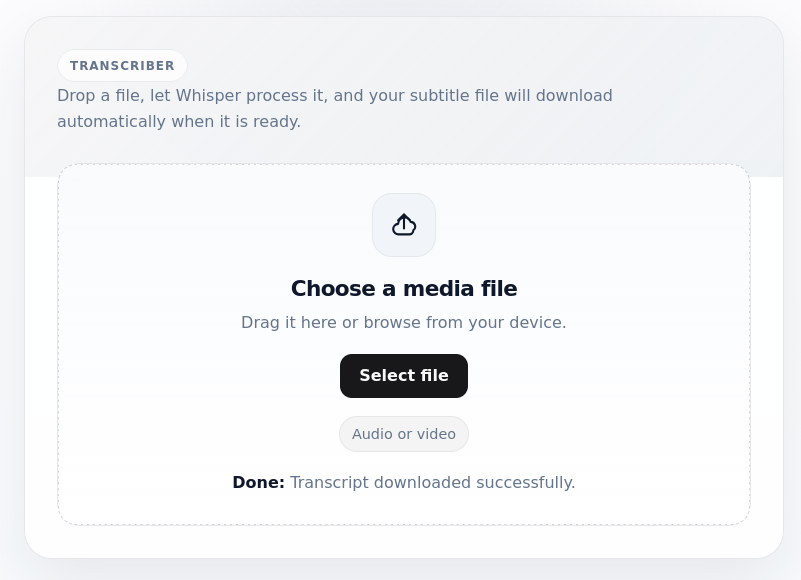

### Description
A full-stack web app that transcribes videos into .srt subtitle files, with a Python Flask backend utilising OpenAI Whisper.

### Deployment
Pull the Python image python:3.8-slim before building: `docker pull python:3.8-slim`   

To build this Docker container: `docker build . -t transcriber`  

To run the container: `docker run transcriber`

A "Temporary failure in name resolution" error may occur caused by PIP failing to resolve DNS name when a VPN is connected, trying disconnecting the VPN to fix this issue.

### Usage
Open the link [http://localhost:5100](http://localhost:5100) in your browser.
